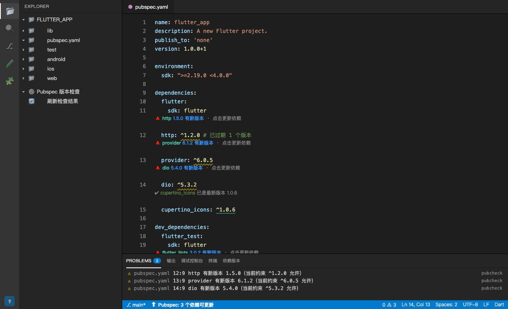
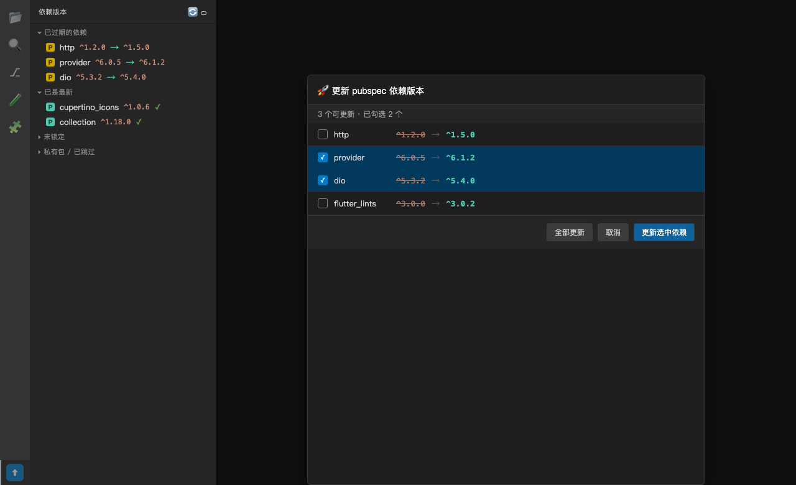

# Pubspec 版本检查器（Pubspec Version Checker）

[](https://marketplace.visualstudio.com/items?itemName=story5.pubspec-version-checker)
[](https://open-vsx.org/extension/story5/pubspec-version-checker)

一个 VS Code / Cursor 扩展：**自动检查 Flutter / Dart 项目 `pubspec.yaml` 中依赖（Package）与插件（Plugin）使用的版本，与 [pub.dev](https://pub.dev) 发布的最新版本对比，并通过多种可视化方式提醒开发者有新版本可用。**

---

## ✨ 功能特性

- 📋 **CodeLens 提示**：在每个依赖行上方显示最新版本，如 `🔺 http 1.5.0 有新版本`，点击即可更新
- 🖍️ **版本号高亮**：过期的版本号在编辑器中以**黄色波浪线**标记，已是最新用绿色标记
- ⚠️ **问题面板诊断**：过期的依赖在「问题」面板生成警告，支持跳转到 `pubspec.yaml` 对应行
- 📊 **状态栏**：显示「N 个依赖可更新」，点击可重新检查
- 🌲 **活动栏树视图**：按「可更新 / 已是最新 / 未锁定」分组展示全部依赖
- 🔍 **Hover 详情**：鼠标悬停依赖行，展示约束 / 当前 / 最新 / 预发布版本
- ⚡ **一键更新**：选择「更新约束为 `^最新版本`」，自动改写 `pubspec.yaml`
- ⏱️ **缓存与并发**：版本查询结果缓存 1 小时（可配置），并发请求防限流
- 🚫 **排除列表**：可跳过私有包 / 不想升级的包

---

## 📸 使用示意

### 1. 打开 pubspec.yaml，自动看到更新提示

打开任意 Flutter / Dart 项目，扩展会自动激活。过期的依赖行上方会出现 **CodeLens**，版本号会被黄色波浪线标注，底部状态栏显示可更新数量。



- **CodeLens**：`🔺 http 1.5.0 有新版本` —— 点击即可弹出更新菜单
- **版本号下划线**：黄色表示过期，绿色表示已是最新
- **问题面板**：列出所有过期依赖，点击直接跳转到对应行
- **状态栏**：`⬆ Pubspec: 3 个依赖可更新`

### 2. 一键批量更新

点击 CodeLens 或树视图中的依赖，可以选择**更新选中依赖 / 全部更新**。扩展会自动把版本约束改写为 `^最新版本`。



---

## 📦 安装方式

### 方式一：从 VS Code 应用商店安装（推荐）

1. 打开 VS Code
2. 点击左侧活动栏的 **Extensions**（扩展）图标，或按 `Ctrl/Cmd + Shift + X`
3. 搜索框输入：`Pubspec 版本检查器` 或 `pubspec version checker`
4. 找到由 **story5** 发布的扩展，点击 **Install**

> 安装后无需配置，打开任意包含 `pubspec.yaml` 的项目即可自动生效。

### 方式二：从 Open VSX 安装（Cursor / VSCodium 用户）

Cursor、VSCodium 等基于 Open VSX 的编辑器请使用此方式：

1. 打开 Cursor / VSCodium
2. 进入 **Extensions**（扩展）面板
3. 搜索：`Pubspec 版本检查器` 或 `pubspec version checker`
4. 找到由 **story5** 发布的扩展，点击 **Install**

也可以直接访问 [Open VSX 扩展页面](https://open-vsx.org/extension/story5/pubspec-version-checker) 安装。

### 方式三：本地安装 vsix

如果你已经拿到 `.vsix` 文件：

```bash
# 在扩展目录下执行
npx @vscode/vsce package
# 生成 pubspec-version-checker-0.1.1.vsix
```

然后在 VS Code / Cursor 中：

- 打开命令面板（`Ctrl/Cmd + Shift + P`）
- 输入 `Extensions: Install from VSIX...`
- 选择生成的 `pubspec-version-checker-0.1.1.vsix`

### 方式四：从源码运行/调试

```bash
git clone https://github.com/Story5/pubspec-version-checker.git
cd pubspec-version-checker
npm install
```

按 `F5` 选择「运行扩展（调试）」，会打开新的「扩展开发宿主」窗口，再打开任意 Flutter 项目即可看到效果。

---

## 🚀 使用步骤

1. **打开项目**：用 VS Code 打开任意 Flutter / Dart 项目
2. **等待检查**：扩展会自动读取 `pubspec.yaml` 和 `pubspec.lock`，并向 pub.dev 查询最新版本
3. **查看提示**：在编辑器、问题面板、状态栏、左侧树视图中查看过期依赖
4. **快速操作**：
   - 点击 **CodeLens** → 选择「更新约束为 ^最新版本」
   - 或按 `Ctrl/Cmd + Shift + P` → 输入 `Pubspec: 检查依赖版本` 手动刷新
   - 或点击状态栏 `⬆ Pubspec: N 个依赖可更新`
5. **应用更新**：保存 `pubspec.yaml` 后运行 `flutter pub get`

---

## ⚙️ 配置项

在 `settings.json` 中配置：

| 配置 | 默认 | 说明 |
| --- | --- | --- |
| `pubcheck.enable` | `true` | 总开关 |
| `pubcheck.showOnlyOutdated` | `true` | CodeLens 只显示「有新版」的依赖，隐藏已是最新 |
| `pubcheck.enableCodeLens` | `true` | 在 `pubspec.yaml` 依赖行上方显示最新版本 |
| `pubcheck.enableDecorations` | `true` | 高亮过期版本号（黄色波浪线） |
| `pubcheck.enableDiagnostics` | `true` | 在「问题」面板中生成警告 |
| `pubcheck.enableStatusBar` | `true` | 在状态栏显示可更新数量 |
| `pubcheck.excludePackages` | `[]` | 跳过检查的包名，如 `["my_private_pkg"]` |
| `pubcheck.cacheTtlSeconds` | `3600` | pub.dev 查询缓存时间（秒） |
| `pubcheck.concurrency` | `5` | 同时向 pub.dev 发起的请求数 |

---

## 🔧 开发

```bash
npm install       # 安装依赖
npm run compile   # 编译到 out/
npm test          # 运行单元测试（node --test）
npm run watch     # 增量编译
npm run package   # 打包 vsix
```

## 🏗️ 项目结构

```
src/
├── extension.ts          # 扩展入口：事件、命令、UI 装配
├── core/
│   ├── versioning.ts     # 版本解析 / 比较 / pub 约束匹配（纯逻辑）
│   ├── pubspec.ts        # pubspec.yaml / pubspec.lock 解析（含行列定位）
│   ├── pubdev.ts         # pub.dev API 客户端（缓存 + 并发）
│   └── analyzer.ts       # 状态汇总分析（纯逻辑）
└── ui/
    ├── codeLensProvider.ts  # CodeLens 提供器
    └── treeProvider.ts      # 活动栏树视图
```

---

## ⚠️ 已知限制

- 当前检查**第一个工作区根目录**（多根工作区取首个含 `pubspec.yaml` 的目录）
- 私有仓库 / 内部 pub 源（非 pub.dev）的包无法查询，会标记为「无法获取版本信息」
- 升级约束为 `^最新版` 后，请自行确认是否存在破坏性变更（major 版本升级）

---

## 📄 License

MIT © [Story5](https://github.com/Story5)
